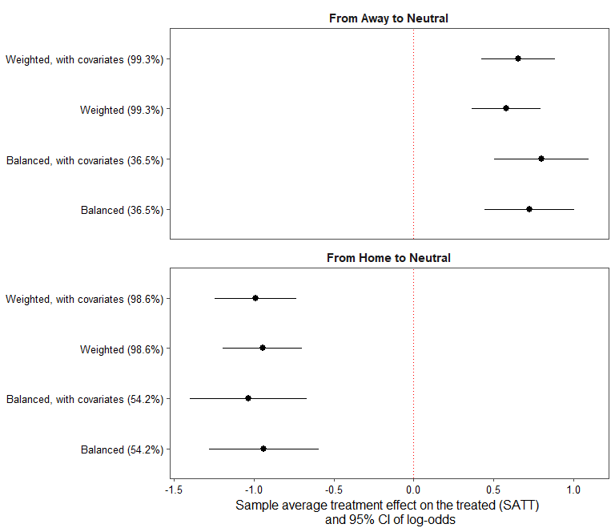
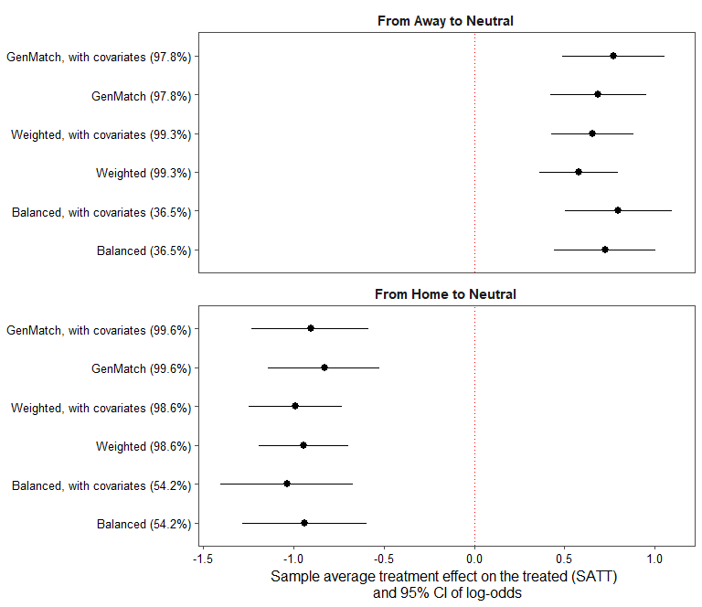

# Assessing the influence of neutral grounds on match outcomes

## Executive summary

Kneafsey and Müller&#39;s paper highlights the positive impact of neutral grounds on sports leagues by providing a balancing effect on home advantage (Kneafsey &amp; Müller, 2018). This memo replicates these findings and extends them by using genetic matching to estimate the causal effect of neutral grounds on match outcomes and conducts a sensitivity analysis to check the robustness of its results. Since it finds that neutral grounds indeed provide a fairer playing field in terms of location-based advantages between teams, this memo recommends the increased use of neutral grounds by the Gaelic football and hurling associations to foster fairer competition while reducing monetary, psychological and physiological costs for teams and players alike. It also suggests further research should be carried out to extend the findings to other sporting events such as international leagues.

-----

The advantage of playing at home is a well-known phenomenon in sports. It is a well-researched fact that teams playing at home have an advantage over the opposing team (Kneafsey &amp; Müller, 2018; Carroll &amp; Collins, 2012; Pollard, 2008; Pollard &amp; Pollard, 2005; Pollard, Prieto, &amp; Gómez, 2017). Many intuitive reasons have been put forward: teams feel more comfortable in their own turf since they practice regularly on it, players experience less performance anxiety due to the familiarity of the environment, the climate is not different from that in which they usually train, the home crowd of fans is more supportive, and so on. It is not difficult to see why the team playing at home would have a considerable advantage over the team that is visiting, in almost all team sports.

The use of neutral grounds, however, although intuitively a &quot;middle ground&quot; between the home and away fields, is not widely used. Many leagues and championships around the world use a home-away dichotomy, where teams play one match at home and one match away and the aggregate result of both games determines who advances to later rounds (for example, the UEFA Champions League [UEFA, 2019]). Neutral grounds are most often used for final games, where the outcome of the match determines the winner of the championship, but these occur very sparingly, and cannot be directly compared to other games since the teams do not have the possibility to advance any further in a final game -- the motivations are different. Thus, although neutral grounds seem like an intuitive option to provide a counterbalance for the home advantage without having to play two games in two different locations, it is not widely employed except for exceptional circumstances such as a final game.1

In their paper, Liam Kneafsey and Stefan Müller (Kneafsey &amp; Müller, 2018) examine the question of whether neutral grounds provide the desired counterbalancing effect by looking at two specific sports leagues, Gaelic football and Gaelic hurling, in Ireland. They find that neutral grounds indeed provide a balance, taking away from the home advantage and giving an extra edge to the away team. However, by using coarsened exact matching they are only able to use a fraction of the original dataset, which means results could be improved upon by using more advanced matching methods. Additionally, they don&#39;t match on a large number of covariates -- thus, a sensitivity analysis could provide insight into how robust the results actually are. This paper sets out to replicate the results in Kneafsey and Müller (Kneafsey &amp; Müller, 2018) and extend them by using genetic matching and then conducting a Rosenbaum sensitivity test on the results, along with a discussion highlighting the potential benefits of using neutral grounds

## The homogeneity of Gaelic football and hurling in Ireland provide a controlled environment to estimate the causal effect of neutral grounds

The main reason for choosing Gaelic football and hurling as the sport to analyse in Kneafsey and Müller&#39;s paper is the homogeneity of the sport in the country and the volume of games played. Ireland is not very large, so there is little (if any) variation in natural factors like weather or temperature that could have an impact on different teams within Ireland. Furthermore, Gaelic football is an amateur league, meaning that the fields these teams play in are fairly similar to each other, since there are no large disparities between the wealth of different clubs. Gaelic football is also by far the best attended sport in Ireland, with hurling being the third behind association football (Kneafsey &amp; Müller, 2018), meaning that there is a lot of data to work with. The dataset the paper uses is freely available online and the results can thus be replicated by anyone.

Although only focusing on Gaelic football and hurling makes the results of the paper less generalizable to other sports around the world, it allows for the natural control of many confounding variables that would otherwise be very hard to control, as mentioned in the previous section. The homogeneity of Ireland and the sports leagues themselves compared to international sports leagues provide a more accurate assessment of the effect of neutral grounds on match outcomes.

Kneafsey and Müller (Kneafsey &amp; Müller, 2018), and this paper, analyze all 3,503 competitive senior men&#39;s inter-county hurling and Gaelic football matches between January 2009 and June 2018. To understand the impact of neutral grounds, the analysis focuses on the favoured team only (based on Elo2 ratings). Furthermore, the analysis incorporates information about the relative team strength (using Elo ratings) and the importance of the match (Championship, late-stage games, and others) to control for factors that could influence the final outcome of the game. The &quot;treatment&quot; of the dataset, therefore, is whether the game was played on a neutral ground or not, with the &quot;outcome&quot; being the win/loss of the team, and the &quot;dependent&quot; variables being the Elo rating and the importance of the match (along with, of course, which sport is being analyzed).

## Our replication verifies the results obtained by Kneafsey and Müller and illustrates the balancing impact of neutral grounds on match outcomes for the home and away teams

We make use of the source code provided by Kneafsey and Müller to replicate their results. By carrying out the same preprocessing procedures, we obtain _Figure 1_ below, which shows the bootstrapped mean results of the outcome of games played at home, away, and on neutral grounds for the favorite team (dictated by Elo rating) by sport. A 1 indicates a win and 0 indicates a loss.

This is purely descriptive, however -- it does not tell us anything about the causal effect of playing on neutral grounds. For that, we carry out coarsened exact matching using the same procedures that Kneafsey and Müller employed, and obtain the results shown in _Figure 2_. The figure is the same that was obtained in the original paper.

The results obtained by Kneafsey and Müller indicate that neutral grounds do indeed have a balancing impact on the advantage of the home team, with the log-likelihood of the favorite team increasing by 0.798 when playing on a neutral ground instead of an away field and decreasing by -1.037 when playing on a neutral ground instead of a home field. However, Kneafsey and Müller are only able to match on 37% of the away data, and 54% of the home data, meaning that this effect represents the sample average treatment effect on the treated (SATT) for the data points that they were able to match on. This makes their results less generalizable, and potentially less robust, as opposed to using the entire dataset.

## Using genetic matching instead of coarsened exact matching adds robustness to the results obtained by increasing the sample size used

In this paper, we extend this analysis by carrying out genetic matching instead of coarsened exact matching. Through genetic matching, we are able to retain 97.8% of the away game data and 99.6% of the home game data, thus adding robustness to the results obtained by Kneafsey and Müller and also improving the generalizability of the results, as the sample examined is now the entire Gaelic football and hurling leagues in the dataset instead of only a fraction of it. Nevertheless, the results we obtain using genetic matching for the causal effect of playing on neutral grounds on the probability of winning for the favored team are very similar to the results obtained by Kneafsey and Müller originally, with the log-likelihood of the favorite team increasing by 0.769 when playing on a neutral ground instead of an away field, and decreasing by -0.904 when playing on a neutral ground instead of a home field. They are displayed in _Figure 3,_ alongside the results from the original paper.

## Conducting a Rosenbaum sensitivity analysis demonstrates the results obtained are relatively sensitive to hidden bias

This paper also extends the results obtained by Kneafsey and Müller by carrying out a sensitivity analysis. Originally, Kneafsey and Müller control for only three covariates that they consider of importance: the relative team strength, measured by the Elo rating, the level of importance of the match, and naturally the type of sport. They justify that other covariates likely have a negligible impact due to the homogeneity of Ireland as a country and the Gaelic leagues as a whole. However, this paper conducts a Rosenbaum sensitivity analysis to investigate whether an unobserved covariate could be explaining the results we see. The idea of the test is to introduce an unobserved covariate X that skews the probability of a unit being assigned to treatment or control, and then calculate by how much the probabilities would have to be skewed for the results observed to become statistically insignificant.

        The results of the Rosenbaum sensitivity test are shown below in _Table 1._

|   | **Home to Neutral** | **Away to Neutral** |
| --- | --- | --- |
| **Gamma** | **Lower Bound** | **Upper Bound** | **Lower Bound** | **Upper Bound** |
| 1.0 | 0 | 0.0000 | 0 | 0.0000 |
| 1.2 | 0 | 0.0000 | 0 | 0.0000 |
| 1.4 | 0 | 0.0001 | 0 | 0.0000 |
| 1.6 | 0 | 0.0022 | 0 | 0.0005 |
| 1.8 | 0 | 0.0160 | 0 | 0.0065 |
| 2.0 | 0 | _0.0639_ | 0 | 0.0369 |
| 2.2 | 0 | _0.1674_ | 0 | _0.1227_ |

Thus, we see that for the home data, an unobserved covariate X that skews the probability of being assigned to treatment by a factor of 2.0 would be enough to explain the results obtained; for the away data, an unobserved covariate that skews the probability by a factor of 2.1 would be sufficient.

## Neutral grounds have a positive impact on match outcomes by providing a balancing effect that reduces home advantages and therefore should be used more often by the Gaelic Football and Hurling Associations

In this paper, we use genetic matching to obtain the causal effect of the influence of neutral grounds on match outcomes and find that they are very similar to those obtained using coarsened genetic matching, even though the former method manages to retain a much larger percentage of the dataset for analysis and thus provides better generalizability and inferential validity. Thus, the genetic matching results reinforce what Kneafsey and Müller found in their original paper.

However, we also find that the results obtained are relatively sensitive, and thus not very robust. An unobserved covariate X would only need to skew the probability of being assigned to treatment by 2.0 and 2.1 for the home and away data, respectively, for the results observed to be statistically insignificant (and possibly explained by the unobserved covariate X). The fact that so many covariates were left uncontrolled for makes these results especially important, since one of these uncontrolled covariates could be driving the results we see for the effect of neutral grounds. For instance, the distance that a neutral ground is from the respective &quot;home&quot; of each team could lead to higher/lower attendance for one side, which could have an influence on match outcomes. Given that there are many possible covariates that were not used in the analysis, the sensitive results from the analysis cast some doubt on the robustness of the results obtained by Kneafsey and Müller.

In light of these findings, this paper asserts that neutral grounds have a positive influence on match outcomes, providing a balancing force that reduces the advantage the home team obtains by playing at home, and reduces the disadvantage that the away team faces by playing away. Because of this, we believe that neutral grounds are a good mechanism to improve the fairness of sporting competitions and should be used more often by the Gaelic football and hurling leagues to provide a fairer matching between teams without having to play two games separately at two different times. Additionally, using neutral grounds would represent a cost reduction for championships that must play two games (one at home and one away) to ensure fair results, not only in monetary terms but also psychological and physiological for the players involved. However, we believe that further research must be done controlling for more covariates to improve the robustness of the results, and thus provide more confidence about the exact effect of using neutral grounds. We also encourage more research to be done on international sporting leagues, which are more often forced to employ the home-away match paradigm to ensure a fair competition, as the time and cost savings of using neutral grounds would be much more consequential for these larger-scale events.34

# References

Carroll, R., &amp; Collins, K. (2012). An examination of home-field advantage in Gaelic football 2001–2010. In Proceedings of the 17th Annual Congress of the European College of Sport Science, 4–7 July, Bruges.

Kneafsey, L., &amp; Müller, S. (2018). Assessing the influence of neutral grounds on match outcomes. International Journal Of Performance Analysis In Sport, 18(6), 892-905. doi: 10.1080/24748668.2018.1525678

Pollard, R. (2008). Home advantage in football: A current review of an unsolved puzzle. The Open Sports Sciences Journal, 1(1), 12–14.

Pollard, R., &amp; Pollard, G. (2005). Home advantage in soccer: A review of its existence and causes. International Journal of Soccer and Science, 3(1), 28–44.

Pollard, R., Prieto, J., &amp; Gómez, M. A. (2017). Global difference in home advantage by country, sport and sex. International Journal of Performance Analysis in Sport, 17(4), 586–599.

UEFA Champions League. (2019). Retrieved from [https://www.uefa.com/uefachampionsleague/](https://www.uefa.com/uefachampionsleague/)

Appendix

All the accompanying code and data for this paper can be found at [https://github.com/DHDaniel/influence-neutral-grounds](https://github.com/DHDaniel/influence-neutral-grounds).
